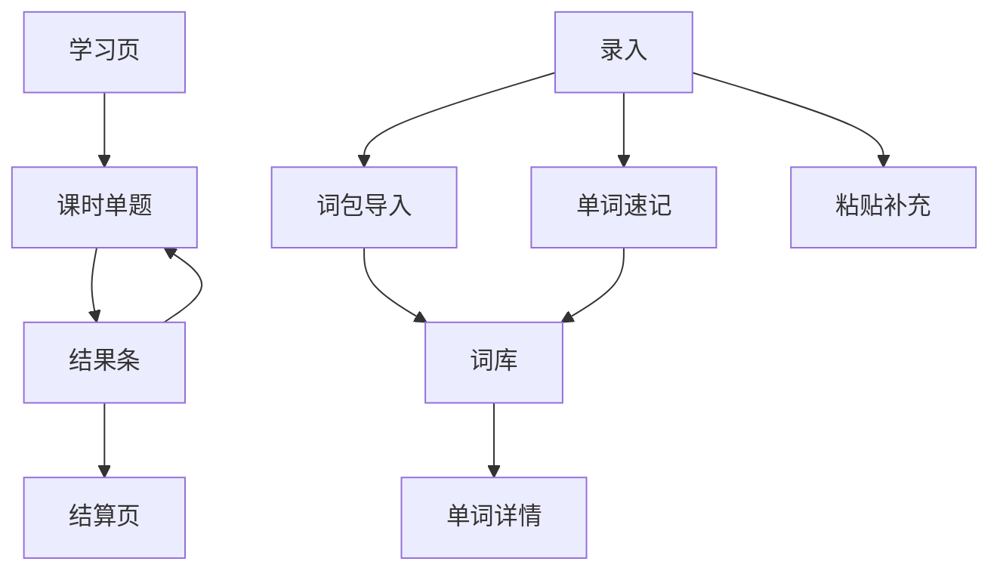

# WordEcho 设计文档

本文档是产品与实现的单一事实来源。后续用 AI 实现时，应先读本文，再改代码；不要另起一套数据模型或复习算法。

技术栈：**Web + TypeScript**（Vite + React + Dexie），目标设备：**iPad**（Safari「添加到主屏幕」的 PWA）。交互参考多邻国：学习路径、单题全屏、大选项、底部「检查 / 继续」、结算页。

---

## 1. 产品一句话

WordEcho 是给小学生用的**本地优先**记单词 PWA：把课文词包一次导入、把读物生词速记入库（释义优先离线词典，未命中再 AI），再按遗忘曲线每天生成三类选择题，并支持发音与跟读。**背单词考题是主功能。**查询用大字典（`dict-lookup`）不当背单词词库。

## 2. 三大功能

| 优先级 | 功能 | 说明 |
| --- | --- | --- |
| P0 | **背单词考题** | 每日按 SRS 组卷；三种题型；听发音 / 跟读；多邻国式课时节奏 |
| P1 | **一次性录入（词包）** | AI 预先生成词表 JSON 放进工程；App 从内置词包或文件导入 |
| P1 | **单词速记** | 只输入英文；释义走 `resolveWord()`（离线词典 → AI） |

不做：账号、云同步、班级排行、生命值扣心、家长端独立 App、真人录音库（用系统 TTS）。

## 3. 信息架构（iPad）

底部三个主入口，**学习**绝对主位：

1. **学习** — 顶部连胜 / XP / 今日目标；一张主卡片一个「开始学习」按钮；下面打卡日历
2. **词库** — 搜索 + 状态标签；单词详情（听 / 跟读）
3. **录入** — 打开就是速记输入框；批量词包折叠在下方

设置（每日题量、TTS、AI Key、导出）放在学习页右上角齿轮，不单独占第四 Tab。



---

## 4. 功能一：一次性录入（词包）

### 4.1 工作流

词表不在 iPad 上手敲中文。流程是：

```
电脑上整理纯单词列表
  → scripts/gen-pack.ts 调 AI 生成 pack JSON
  → 人工核对
  → 提交到 src/data/packs/<pack-id>.json
  → iPad App「录入 → 词包」选择内置词包一键导入
     （也支持从 Files 选一个同 schema 的 JSON 文件）
```

粘贴文本框保留为补充手段（临时加几行词），走同一套 `resolveWord()`。

### 4.2 词包 JSON Schema

文件路径：`src/data/packs/<pack-id>.json`

```ts
type WordPack = {
  id: string;                 // 如 "pep-g3-vol1"
  title: string;              // "人教 PEP 三年级上"
  curriculum: string;         // "pep" | "fltrp" | "other"
  grade: string;              // "三年级"
  volume: string;             // "上册"
  language: "en";
  version: 1;
  words: PackWord[];
};

type PackWord = {
  word: string;               // 展示形态，如 "elephant"
  lemma?: string;             // 缺省则 word.toLowerCase().trim()
  ipa: string;                // "/ˈelɪfənt/"
  pos: string;                // "n" | "v" | "adj" | "adv" | "prep" | "phr" | ...
  zh: string;                 // ≤ 16 个汉字，小学生白话
  examples: { en: string; zh: string }[];  // 1～2 条
  unit: string;               // "Unit 2" / 课文名
};
```

约束：

- 同一 pack 内 `lemma` 唯一。
- `zh` 禁止超纲义、俚语、成人语境。
- 例句以简单现在时为主。

### 4.3 精品兜底词典 `dict-core`

文件路径：`src/data/dict-core.json`

```ts
type DictCore = {
  version: 1;
  words: {
    lemma: string;
    display: string;
    ipa: string;
    pos: string;
    zh: string;
    examples: { en: string; zh: string }[];
  }[];
};
```

用途：

1. 单词速记 / 粘贴时优先本地命中释义（质量高于大字典）。
2. 选择题干扰项不足时兜底（**仅用本文件，不用查询词典**）。
3. 目标规模约 2000～3000 小学高频词（可分期扩充）。

### 4.3b 查询词典 `dict-lookup`（不当背单词）

文件路径：`src/data/dict-lookup.json`（由 `scripts/build-dict-lookup.ts` 从 [ECDICT](https://github.com/skywind3000/ECDICT) 筛常用子集生成，约 2～3 万词）。

```ts
type DictLookup = {
  version: 1;
  /** lemma → [ipa, pos, zh]；无例句 */
  w: Record<string, [string, string, string]>;
  /** 屈折形 → lemma；已有 lemma 键不被覆盖 */
  f: Record<string, string>;
};
```

硬边界：

- **只用于查询**：`resolveWord()` 在本机词库 / dict-core / pack 未命中时查本文件。
- **绝不批量导入** IndexedDB 词库或 SRS；只有孩子点「添加」保存的那一条才进复习队列。
- **组卷选词 / 词库列表 / 干扰项** 都不读 `dict-lookup`。
- 无例句；`zh` **保留 ECDICT 全部常用义项**（POS 组之间用 `；` 连接，去掉 `[计]`/`[医]` 等专业尾巴），软上限约 120 字（超长在义项边界截断）。与 dict-core / pack 的 ≤16 字白话不同——后者仍用于学习卡片与干扰项。CSV 源文件不进仓库。

### 4.4 生成与校验脚本

| 脚本 | 职责 |
| --- | --- |
| `scripts/gen-pack.ts` | 输入：纯单词列表（txt，一行一词）+ 元数据（curriculum/grade/volume）。调 OpenAI 兼容 API，批量产出 `PackWord` 字段，写出 `src/data/packs/<id>.json`。每批最多 40 词。 |
| `scripts/build-dict-lookup.ts` | 从 ECDICT CSV 筛常用词，写出 `dict-lookup.json` + 屈折索引；`zh` 保留全部常用义项（软上限 ~120 字）。 |
| `scripts/validate-data.ts` | 校验 pack 与 dict-core（含 examples，zh ≤16）；校验 dict-lookup（lemma 去重、zh 非空、zh ≤120，不要求 examples）。失败则 `npm run check` 非零退出。 |

提示词固化在 `scripts/prompts/enrich-words.ts`：面向中国小学生、短白话、禁止超纲。

### 4.5 App 内导入 UX

- 列表展示工程内已打包的词包（title、词数、是否已导入）。
- 「导入」：合并进本地词库；已存在的 lemma 合并 `sources`，不复制卡片；新词初始化 `ReviewState`。
- 「从文件导入」：用户选 JSON，校验 schema 后同上。
- 导入全程离线（词包已含释义）。

---

## 5. 功能二：单词速记

场景：读课外书时看到生词，只打英文。

```
输入 1 个或多个英文词（空格 / 换行）
  → 对每个词调用 resolveWord()
  → 展示结果卡（可改 zh / 例句）
  → 保存；新词进入复习队列
```

**禁止**把中文意思做成必填输入框。

### 5.1 `resolveWord(lemma)` 统一解析

```
1. 查本地词库（已录入）→ 返回已有记录（可只加 reading 来源）
2. 查 dict-core → 命中则直接 complete
3. 查内置 pack 索引（课文释义更好；与 1 合并后通常已覆盖已导入词）
4. 查 dict-lookup（含屈折形）→ 命中则 complete；字典本身不进复习队列
5. 有 AI Key 且联网 → 调 AI 补全 → complete
6. 否则 → enrichStatus = "pending" | "failed"；单词仍保存，可重试
```

粘贴补充路径同一逻辑；若行内已带中文（`apple / 苹果`），则 `zh` 采用行内值，音标 / 例句仍尽量从 dict-core / dict-lookup 或 AI 补。

---

## 6. 功能三：背单词考题（主功能）

### 6.1 多邻国式课时节奏

1. **学习页**：只有一张绿色主卡片 + 一个「开始学习」按钮（今日已完成时变「再练一组」），下面是打卡日历（`prefs.studyDates` 标橙点，今天描蓝虚线圈）。**不出现 Unit 列表**。加练走 `startPractice()`，优先抽今日到期但没排进配额的词，且不写 SRS。
2. **进入课时**：全屏单题；顶部进度条；大选项（≥ 56px 触摸高）；底部固定「检查」。
3. **提交后**：底部升起绿 / 红结果条（文字说明对错，不只靠颜色）；「听一听」「我来读」用圆角图标按钮（喇叭 / 麦克风），不用文字按钮；点「继续」。
4. **本课答错的词**：堂末再插一题（不另开 SRS 结算，只即时巩固）；跟读永不计分。
5. **结算页**：正确率、获得 XP、连胜是否延续、错词列表、「再练错词」（不改 SRS）。

不做生命值扣心。中途退出：同自然日可续；跨日旧卷作废，按新 due 重组。

### 6.2 三种题型

| ID | 名称 | 题干 | 选项 | 答题前音频 |
| --- | --- | --- | --- | --- |
| T1 | 英译中 | 英文单词 | 3 个中文 | 可读该英文 |
| T2 | 中译英 | 中文意思 | 3 个英文 | **禁止**读正确英文；反馈页才可读 |
| T3 | 缺字母 | 带 `_` 的英文 | 3 组字母 | 默认可听完整词 |

选项始终 3 个。对错用颜色 + 文字。

### 6.3 每日组卷（惰性，不预存题库）

打开学习页或点「今日关卡」时计算：

**选词**

1. 取全部 `dueAt <= today` 的词。
2. 若不足 `dailyLimit`（默认 15，范围 8～30），用新词（`repetitions === 0`）补齐。
3. 若仍不足，最多提前 2 个「明天到期且 ease 较低」的词。
4. 若到期超过 `dailyLimit`：优先 `lapses` 高、`intervalDays` 短的；其余 `dueAt` 不变，明天再优先。

**题型**（确定性）

```
hash(wordId + date) % 3
  0 → T1
  1 → T2
  2 → T3（词长 < 3 或挖空失败 → 降级 T1）
```

同一天同一词只出 **1** 题（堂末错题再练除外，再练不改 SRS）。

**干扰项**

- 优先本机词库：同 `pos`、相近长度、同年级来源。
- 不足用 `dict-core`。
- 不能等于正确答案；选项用 `wordId + date + type` 稳定洗牌。

**T3 挖空**

- 词长 3～4：挖 1 字母；≥ 5：优先挖 2 个连续字母。
- 优先元音或常见辅音组合；一般不挖首字母（词长 = 3 且别无选择除外）。
- 干扰项模拟常见拼写错误（`f/ph`、`i/e`、`ea/ee`）。

伪码（实现落在 `src/lib/quiz.ts`）：

```ts
function buildDailyQuiz(words, reviews, date, limit, dictCore): QuizItem[] {
  const selected = selectWordsForDay(reviews, words, date, limit);
  return selected.map((w) => {
    const type = pickType(w.id, date, w.display);
    const { options, answerIndex, cloze } = buildStem(type, w, words, dictCore, date);
    return { wordId: w.id, type, options, answerIndex, cloze, ... };
  });
}
```

### 6.4 SRS（简化 SM-2）

按**本地日历日**。实现：`src/lib/srs.ts`，纯函数。

| 结果 | 更新 |
| --- | --- |
| 错 | `repetitions = 0`；`intervalDays = 1`；`ease = max(1.3, ease - 0.2)`；`lapses += 1` |
| 对且 repetitions === 0 | `intervalDays = 1`；`repetitions = 1` |
| 对且 repetitions === 1 | `intervalDays = 3`；`repetitions = 2` |
| 对且 repetitions ≥ 2 | `intervalDays = max(4, round(intervalDays * ease))`；`ease = min(2.8, ease + 0.1)` |

`dueAt = today + intervalDays`。全对直觉：**1 → 3 → ~7 → ~16 天**。

新词录入当天即可进入新词配额。跟读、堂末再练、结算页「再练错词」均 **不** 调用 SRS 更新。

### 6.5 发音与跟读

**听一听**：`speechSynthesis`，`en-US` / `en-GB`，语速默认 0.9。iPad Safari：首次播放必须挂在用户手势上。

嗓音不能用系统默认：默认往往是 compact 版，读起来发闷。`src/lib/speech.ts` 的挑选顺序是 `prefs.ttsVoice`（用户在设置里选的）→ 优选名单（Samantha / Ava / Daniel / Google US English…）→ 本地嗓音 → 第一个英文嗓音，并过滤掉 Bells、Zarvox 这类玩笑嗓音。设置页列出可选英文嗓音并提示：iPad「设置 → 辅助功能 → 朗读内容 → 嗓音 → 英语」下载 Enhanced/Premium 后即可选用。

**答完题自动念一遍**：亮答案（`revealed`）之后，`LessonPage` 自动把 `word.display` 念一次，孩子不用再去点喇叭。规则：

- **只在亮答案之后**。T2（中译英）答题前既不显示喇叭按钮也不朗读，硬约束不变；`item.audioBeforeAnswer` 仍然只管答题前那一次。
- **排在音效后面**。离线渲染量出来 `playCorrect` 的钟音 0.36s 收完（-30dB 在 0.29s）、`playWrong` 0.33s 收完，所以延迟 `AUTO_SPEAK_DELAY_MS = 400`（在 `LessonPage.tsx`），留 ~40ms 空隙：既不和音效抢，也没有多余的空白。
- **每题只念一次**。用 `autoSpokenFor` 记住已经念过的 `item.id`，重渲染和 StrictMode 的重复副作用都不会念第二次；点喇叭按钮是另一条路，不影响这个计数。
- **点「继续」和退出课时都要掐掉**。`cancelAutoSpeak()` 同时 `clearTimeout` 排队的朗读和 `stopSpeaking()`（`speechSynthesis.cancel()`），上一题的词绝不会念到下一题上。
- **手势链**：iPad Safari 只放行用户手势里起的 `speechSynthesis`。朗读隔着一个 `setTimeout`，手势上下文已经断了，所以在「检查」的点击处理里先调 `warmUpSpeech()` 空跑一条静音 utterance 把引擎解锁，之后定时器里再 `speak()` 就能出声。代价是每题会多一次 `speak("")` 调用（音量 0，听不见）。
- 开关：`UserPrefs.autoSpeak`，默认 `true`，设置页在「答题音效」下面一行。

**跟读**（两层降级）：

1. 点「我来读」时**立刻** `getUserMedia`（必须挂在用户手势上）。**这条流要一直活到录完**：不要在范读前 `track.stop()`，也不要等 TTS 后再开第二条流——iOS 没有新的用户手势时第二条流经常是静音。范读 `onend` / 超时后 `speechSynthesis.cancel()`，再空约 180ms，然后用**同一条流**开 `MediaRecorder`。
2. **iPad / Safari 跳过 `SpeechRecognition`。** 系统往往挂了 `webkitSpeechRecognition` 但转写是空的：识别先空转约 3 秒，孩子已经说完，后面的录音只接到尾巴。目标机以录音对照为准。
3. 范读结束后麦克风按钮进入 listening，再录约 **4 秒**（不含 TTS）。孩子在红点亮起时开口。`MediaRecorder` **不要强行指定** `audio/mp4`（Safari 上会出现有 blob 但回放全静音）；用默认构造，`start()` 不要 timeslice。`requestData` 后再 `stop`，等到 `onstop` 才停轨道、拼 blob、回放。文案：`已录下你的声音，和范读对比听听看`。**不要**显示「没听清」。
4. 非 Safari 且识别可用、拿到**非空**转写：规范化比较 → `很接近` / `再试一次`。识别已经开过一轮却失败：不要再开第二段录音（孩子不会再说一遍）。转写为空的 `没听清` 只留给 `gradeFollow` 本身。
5. 麦克风权限被拒：`没有麦克风权限`。录音失败（空 blob / 编码器不可用）：`这次没录上，再点一次试试`。
6. 无麦克风：隐藏跟读，保留听发音。

跟读不计对错、不改间隔。

### 6.6 音效怎么合成的

音效一律 `src/lib/sfx.ts` 现场合成，不打包音频文件（硬约束）。**不做掌声**：合成掌声（噪声 + 滤波 + 卷积混响那一整套）在 iPad 外放上怎么调都像静电或塑料袋，试过两版都被否掉，相关代码已整条删除。奖励感改由纯调性的音来承担——正弦分音合成出来是可信的。

- **音色**：`voice()` 是唯一的音色，钟琴 / 马林巴那一类。基频放一对分别 -4 / +5 音分的正弦（慢速拍频 = 暖），上面叠 2.01x / 3.02x / 4.97x 三个快速衰减的分音（略微不整数才有真实乐器的不谐感），起音 7ms 左右（再快会有「咔」），衰减用指数。出口一个 lowpass 收掉边角。分音音量在函数里归一化，所以 `gain` 就是这个音的峰值。
- **答对**：E5 → B5 两个钟音（间隔 80ms），0.36s 收完。`combo` 越大音高抬一点（最多 +3%）、`bright` 从 0.85 涨到 1.6、lowpass 从 3.6kHz 开到 6.2kHz，所以连对越多越亮，但音色不变。
- **里程碑**：高八度的 C6-E6-G6 三连闪音，`bright = 1.7`、lowpass 7kHz，叠在答对音后面。
- **答错**：保持原样，320Hz → 250Hz 两声正弦，柔和不刺耳，不做任何「错了」的音响暗示。
- **结算**：C5-E5-G5-C6 上行琶音（每音间隔 100ms），落在 C 大三和弦（C4-G4-C5-G5，1.5s 余韵）上收住，再加一个很轻的 G6 闪音。不用掌声也听得出「这一课结束了」。
- **电平**：没有掌声就不需要限幅器，`DynamicsCompressor` 一并删了；总线只剩 `MASTER = 2.2`。离线渲染实测峰值 correct 0.42 / combo 0.41 / wrong 0.28 / finish 0.49，零削顶样本，iPad 外放够响。
- **验证是「音」不是「噪声」**：`tmp-audio/spectrum.mjs` 量谱平坦度和谱峰占比。四段的平坦度都在 1e-6 量级（宽带噪声会接近 1），90% 以上能量落在少数几个谱峰 ±30Hz 内，6kHz 以上几乎为 0。

`scheduleCue(ac, cue, at, combo)` 是唯一的合成入口，`playCorrect / playCombo / playWrong / playFinish` 都走它。它接 `BaseAudioContext`，所以可以拿 `OfflineAudioContext` 把同一段代码离线渲染成 wav 来试听、量峰值。

---

## 7. 数据模型（本机 IndexedDB）

```ts
type WordSourceKind = "textbook" | "reading" | "pack" | "paste";

type WordRecord = {
  id: string;
  lemma: string;
  display: string;
  ipa: string | null;
  meaningZh: string;
  pos: string | null;
  examples: { en: string; zh: string }[];
  sources: {
    kind: WordSourceKind;
    packId?: string;
    grade?: string;
    volume?: string;
    unit?: string;
    note?: string;
  }[];
  enrichStatus: "complete" | "pending" | "failed";
  createdAt: string;
  updatedAt: string;
};

type ReviewState = {
  wordId: string;
  ease: number;              // 默认 2.5
  intervalDays: number;
  repetitions: number;
  dueAt: string;             // YYYY-MM-DD 本地日或 ISO 日期部分
  lastResult: "again" | "good" | null;
  lapses: number;
};

type QuizSession = {
  id: string;
  date: string;              // YYYY-MM-DD
  itemIds: string[];
  currentIndex: number;
  finishedAt: string | null;
  xpEarned: number;
};

type QuizItem = {
  id: string;
  sessionId: string;
  wordId: string;
  type: "en_to_zh" | "zh_to_en" | "cloze";
  prompt: string;
  options: string[];         // length 3
  answerIndex: 0 | 1 | 2;
  cloze?: { wordShown: string; blanks: string };
  audioBeforeAnswer: boolean;
  chosenIndex: 0 | 1 | 2 | null;
  correct: boolean | null;
  isRetry: boolean;          // 堂末再练
};

type UserPrefs = {
  dailyLimit: number;        // 默认 15
  ttsLang: "en-US" | "en-GB";
  ttsRate: number;           // 默认 0.9
  ttsVoice?: string | null;  // SpeechSynthesisVoice.name，空 = 自动挑
  soundOn?: boolean;         // 默认 true，答题音效
  autoSpeak?: boolean;       // 默认 true，亮答案后自动念一遍单词
  streakDays: number;
  lastStudyDate: string | null;
  studyDates: string[];      // 打卡日历用，YYYY-MM-DD
  xpToday: number;
  xpDate: string | null;
  aiBaseUrl?: string;
  aiApiKey?: string;
  aiModel?: string;
};
```

存储：Dexie (IndexedDB)。导出 / 导入 JSON；默认导出不含 AI Key。

---

## 8. 界面规格（多邻国风 × iPad）

### 8.1 全局

- 主色高对比；大圆角卡片；拇指区底部主按钮。
- 文案短：`开始` `检查` `继续` `听一听` `我来读` `导入`。
- 触摸目标 ≥ 56px；横竖屏均可（竖屏优先路径，横屏双栏可选）。
- 对错：颜色 + 文字（色觉友好）。
- 测验中不出现长表单。

### 8.2 屏幕清单

| ID | 名称 | 关键元素 |
| --- | --- | --- |
| S1 | 学习 | HUD（连胜 / XP / 目标）、主卡片 +「开始学习」、打卡日历 |
| S2 | 课时题 | 进度条、题干、3 大选项、喇叭图标、底部「检查」 |
| S3 | 结果条 | 对/错文案、正解、喇叭 / 麦克风图标、「继续」 |
| S4 | 结算 | 奖杯、XP / 正确率 / 待复习三块成绩、错词列表（最多 6 条） |
| S5 | 词库 | 搜索、状态标签（新词 / 待补全 / N 天后） |
| S6 | 单词详情 | 音标、中文、例句、听/跟读、下次复习日 |
| S7 | 录入 | 顶部一行速记输入框 + 结果卡；批量词包收在折叠区里 |
| S8 | 设置 | 每日题量、口音、朗读嗓音（可选 Enhanced）、语速、AI、导出 |

### 8.3 激励（轻量）

- **连胜**：连续有「完成至少一课」的自然日；断则归零（可先不做冻结道具）。
- **XP**：每题答对 +10，堂末再练答对 +5；仅展示，不兑换。
- **每日目标环**：`今日完成题数 / dailyLimit`。

### 8.4 情绪反馈（夸要夸到点上）

文案全部由 `src/lib/praise.ts` 的纯函数产出，可单测，**不要在组件里写死夸奖字符串**。

- `praiseCorrect()`：按优先级挑一句——堂末补回来的错题 > 连对里程碑（3/5/10）> 以前错过 N 次的词终于答对 > 题型（完形 = 夸拼写、中译英 = 夸最难的答对了）> 2.5 秒内作答 = 夸反应快 > 新词第一次就对 > 熟词答对 N 次。
- `praiseWrong()`：只鼓励，禁止任何负面评价。差一个字母就直说差一个字母；形近词就点出「这两个词长得像」；刚才连对过就先肯定连对。
- `praiseFinish()`：满分 / 错题全补回来 / 连续打卡满 7 天 / 高正确率 / 最长连对，各有专属夸法；正确率低时说「今天也坚持下来了」。
- **叫名字**：`prefs.name`（孩子在学习页 HUD 里自己填，可不填）以 `name?` 传进三个 context，由 `praise.ts` 内部的 `withName()` 拼成「小明，全对！一个都没错」——全角逗号，只加在 `title` 前面，`note` 不动。名字必须是入参，`praise.ts` 里不许读库。
  - 点名的场合（挑「一课里最多几次」的高光时刻，一句一句念下来不别扭）：`praiseFinish()` 全部（结算只出现一次，最值得点名）、`praiseWrong()` 全部（安慰要说给人听，而且答错本来就不多）、`praiseCorrect()` 只有里程碑那几句——堂末补回来、连对 5、连对 10 的倍数、以前错过 ≥2 次的词终于拿下。
  - 不点名的场合：`praiseCorrect()` 里普通的「答对了！」「连对 3 题」「拼写全对！」「反应真快！」等。一课 15 题句句点名会很快变得烦人。
  - 规则是确定性的（不掺随机），所以可单测；名字里自带的首尾空格和结尾标点会被去掉，免得出现「小明！，全对」。
  - **名字为空或没填时，每一句必须和没有名字时逐字一致**（`src/lib/praise.test.ts` 里对全部分支做了逐句比对）。
- 音效在 `src/lib/sfx.ts` 用 Web Audio 现场合成，**不打包音频文件**，离线照样响，而且只用调性音、不做掌声：答对 = 两个上行的暖钟音（连对越多越亮），连对 5 的倍数追加高八度的三连闪音，答错 = 柔和下行两声（绝不刺耳），结算 = 上行琶音落在大三和弦上。合成细节见 6.6。`prefs.soundOn` 可关。
- 动效：结果条从底部弹起、正确项 pop、错误项抖动、连对火苗徽章、`+10 XP` 弹出、结算撒花（`Confetti`，`prefers-reduced-motion` 下自动关掉）。

---

## 9. 技术选型

| 层 | 选择 |
| --- | --- |
| 应用 | Vite + React + TypeScript |
| 路由 | 学习 / 词库 / 录入 / 课时全屏 |
| 本地库 | Dexie |
| TTS | `speechSynthesis` |
| 跟读 | Safari 直接录音回放；其它浏览器可先识别 |
| AI | OpenAI 兼容 Chat Completions（设置里配；脚本与 App 共用协议） |
| 纯函数 | `src/lib/srs.ts`、`src/lib/quiz.ts`、`src/lib/resolve-word.ts`、`src/lib/praise.ts` + Vitest |
| 音效 | `src/lib/sfx.ts`，Web Audio 合成，无音频资源 |
| PWA | Vite PWA 插件；缓存 shell + packs + dict-core + dict-lookup；离线可考 |

### 9.1 目录建议

```
src/
  app/                 # 路由与页面
  components/          # 路径节点、选项、结果条、音频按钮
  db/                  # Dexie schema + repos
  lib/
    srs.ts
    quiz.ts
    resolve-word.ts
    parse-import.ts
    speech.ts
    ai-enrich.ts
  data/
    packs/*.json
    dict-core.json
    dict-lookup.json   # 查询词典，不当背单词
    fallback-words.ts  # 极小兜底，可与 dict-core 合并
scripts/
  gen-pack.ts
  build-dict-lookup.ts
  validate-data.ts
  prompts/enrich-words.ts
docs/DESIGN.md
```

### 9.2 iPad / Safari 注意

- 音频与麦克风权限需用户手势触发。
- `standalone` 显示模式；安全区 padding。
- 大屏：路径与课时可用较宽 max-width 居中，避免题干过宽。

---

## 10. AI 补全（运行时）

仅当 `resolveWord` 未命中离线数据时调用。

请求：`{ words: string[]; audience: "elementary_zh"; gradeHint?: string }`

返回每词：`lemma, ipa, pos, meaningZh, examples[]`（与 pack 字段同语义）。

失败：该词 `pending`/`failed`，其它成功词照常保存。无 Key：速记不可标为 complete，除非 dict-core / pack / dict-lookup 已命中。

---

## 11. 验收标准

1. 选择内置词包导入后，词库按 Unit 可见，刷新不丢失；再次导入同 pack 不产生重复 lemma。
2. `validate-data` 能抓出重复 lemma、空 zh、空 examples。
3. 速记只输入生僻词（dict-core 与 dict-lookup 皆无）：有 Key 时 AI 补全可保存；无网/失败时 pending 可重试。
4. 速记命中 dict-core 或 dict-lookup 时完全离线完成；查询词典不批量进词库。
5. 昨天新词答对 → 今天仍 due；再答对 → 约 3 天后才 due。
6. 同一天同一词主卷只一题；三种题型在多词试卷中可出现。
7. T2 答题前不能听到正确英文；T1/T3 可以。
8. 跟读无权限不崩溃；有权限时反馈不影响 SRS。
9. 断网仍能打开已缓存的 PWA 并完成测验（不依赖 AI）。
10. 导出 JSON 再导入，词与复习状态、连胜恢复（不含 Key 除非勾选）。

## 12. 实现顺序

1. Dexie 模型 + 词库列表 + 单词详情（TTS）
2. 读入 packs / dict-core + 词包导入页
3. `resolve-word` + 速记 + 粘贴补充
4. `srs.ts` / `quiz.ts` 纯函数 + Vitest
5. 学习路径 + 课时 UI（三题型，无跟读）
6. 结果条、堂末错题、结算、XP / 连胜
7. 跟读双降级
8. `gen-pack` / `validate-data` 脚本
9. PWA 与 iPad 触控打磨

## 13. 开放默认（实现时不必再问）

| 问题 | 默认 |
| --- | --- |
| 教材版本 | pack 元数据字段预留；首包等用户提供后再生成 |
| 一词多义 | 只保留一条主义 |
| 大小写 | lemma 小写；题面用 display |
| 中文 | 简体 |
| 新词首次出现 | 录入当天可进新词配额 |
| 离线 | 测验与已导入词完全离线；仅未命中 dict-core/pack/dict-lookup 的速记才需要网（或 AI） |

## 14. 给实现 AI 的硬约束摘要

见仓库根目录 [AGENTS.md](../AGENTS.md)。
